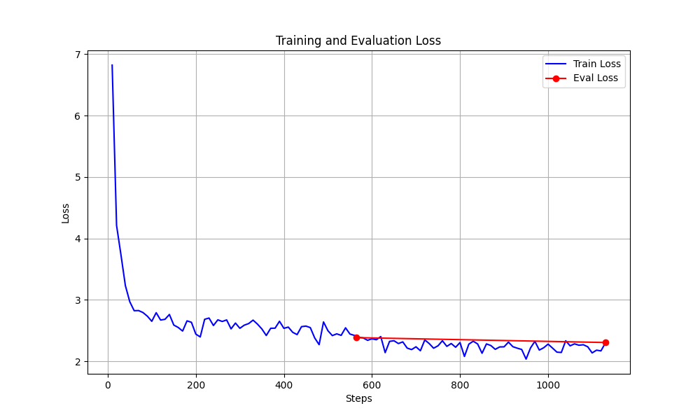

# 🤖 Cartman-style Russian Dialogue Bot

This project is a fine-tuned conversational model that simulates the speech style of **Eric Cartman** from the TV series *South Park*, using Russian-language data. The system is built using Hugging Face Transformers and deployed as a Telegram bot.

---

## 🧠 Model Training Overview

### 📝 Dataset

The training dataset was manually prepared and includes real and generated dialogues with the following format:
- Contexts are wrapped in `[OTHER] ... [/OTHER]`
- Responses are wrapped in `[CARTMAN] ... [/CARTMAN]`
- Texts are translated to Russian using `facebook/nllb-200-distilled-600M`

### 🧪 Training Setup

- Base model: `sberbank-ai/rugpt3small_based_on_gpt2`
- Library: `transformers`, `datasets`, `Trainer`
- Trained for 5 epochs
- Best model selected based on validation loss
- Logging of train and validation loss each epoch

### 📈 Loss Graph

Below is the loss graph during training:



---

## 🚀 Deployment (Docker)

1. **Build the Docker container:**

```bash
docker build -t cartman-bot .
```

2. **Run the bot:**

```bash
docker run -e TELEGRAM_TOKEN=your_token_here cartman-bot
```

---

## 📂 Project Structure

```
├── cartman_model_best/        # Trained model + tokenizer
├── training_logs.json         # Training metrics
├── training_loss_plot.png     # Loss curve
├── inference.py               # Reply generation function
├── telegram_bot.py            # Telegram polling bot
├── Dockerfile
├── requirements.txt
└── README.md
```

---

## 📬 Example usage

**User:**
> Почему ты опять проспал, Эрик?

**Bot:**
> Потому что ваши дурацкие уроки — это для лузеров, понял?

---

## 🇷🇺 Описание на русском

Этот проект — Telegram-бот, разговаривающий в стиле Эрика Картмана. Модель обучена на русском языке с учётом стилистики персонажа. В проекте реализовано:
- Подготовка и перевод датасета
- Генерация фраз с учётом контекста
- Запуск через polling в Telegram

Для запуска используйте Docker-инструкции выше или обычный `python telegram_bot.py`.

---
